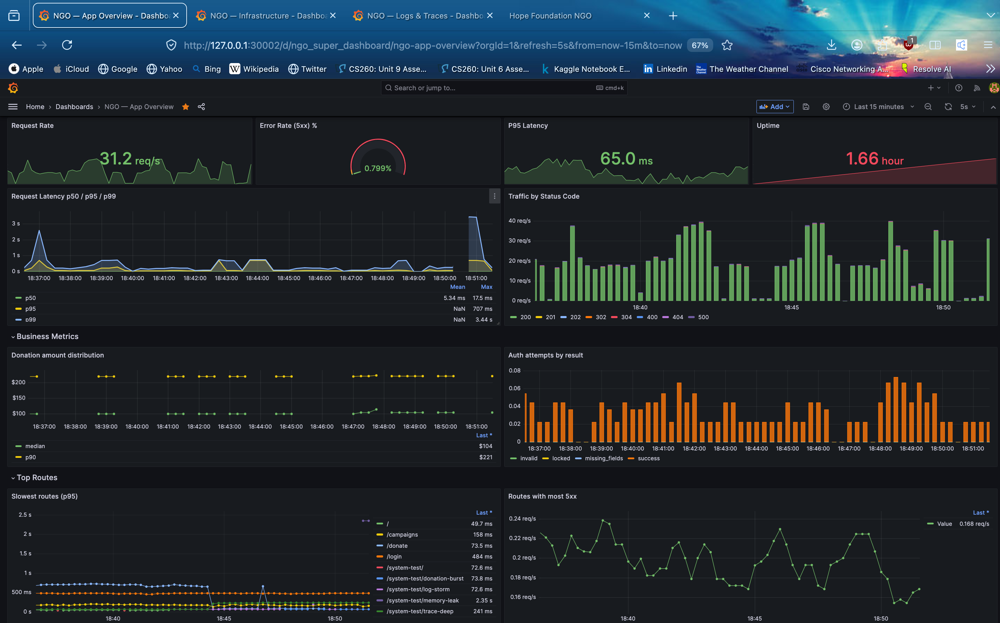
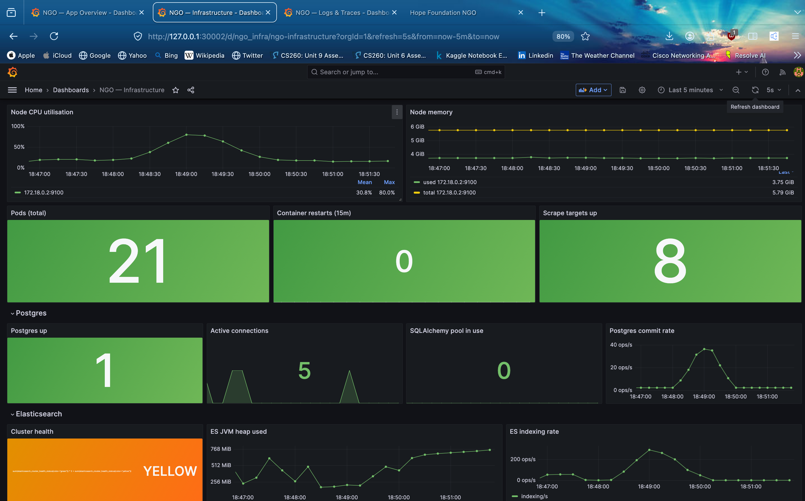
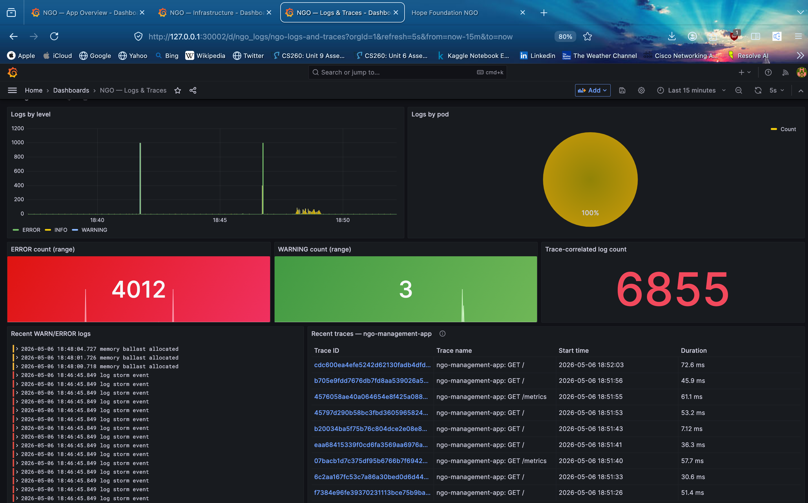

# NGO Management Platform

A donation-tracking web app for an NGO ("Hope Foundation") with a fully-instrumented observability stack: Prometheus + Grafana + Jaeger + Fluentd + Elasticsearch + Alertmanager, all on Kubernetes.

## Dashboards

| App Overview | Infrastructure | Logs & Traces |
|---|---|---|
|  |  |  |


## ✨ Features

- **Role-based access**: public users, authenticated donors, administrators.
- **Campaign management**: admins create/close campaigns; auto-close when goal is hit.
- **Donor tracking**: aggregates per-email donors (registered + guest) with lifetime totals.
- **JSON donation API** with rate limiting and CSRF protection.
- **Faker-driven dummy data** for development.
- **End-to-end observability**: every request emits a metric + trace + structured log, all correlated by `otelTraceID`.
- **Fault-injection toolkit** (`/system-test/*`) — admin-only load/error/log/memory injectors for exercising dashboards and alerts.

## 🚀 Getting Started (Kubernetes — recommended)

```bash
# 1. Create cluster
kind create cluster --name kind --config k8s/kind-config.yaml

# 2. Build + load images
docker build -t ngo-web-app:latest .
docker build -t ngo-fluentd:latest ./monitoring/fluentd
kind load docker-image ngo-web-app:latest --name kind
kind load docker-image ngo-fluentd:latest --name kind

# 3. Apply everything
kubectl apply -k k8s/

# 4. Verify
bash tests/monitoring/bash/smoke.sh
```

Full setup guide with troubleshooting, teardown, and per-step verification: see [SETUP.md](SETUP.md).

### docker-compose (alternative)

```bash
docker-compose up -d --build
```

App at `http://localhost:5001`. Configs are kept in sync with the K8s path.

## 👤 Becoming an admin

The first user is **not** automatically an admin. Sign up via `/auth`, then:
```bash
kubectl exec deploy/web -- flask promote-admin you@example.com
```

## 🛠 Observability Stack

| Service | URL (K8s) | Purpose |
|---|---|---|
| App | http://localhost:30001 | Flask UI |
| System-test panel | http://localhost:30001/system-test/ | Admin fault-injection (admin-gated) |
| Grafana | http://localhost:30002 | 3 dashboards: App / Infra / Logs+Traces |
| Prometheus | port-forward 9090 | metrics + alert rules |
| Jaeger | port-forward 16686 | distributed traces |
| Elasticsearch | port-forward 9200 | log + trace storage |
| Alertmanager | port-forward 9093 | alert routing |

## 🛣 Routes (summary)

Public:
- `GET /`, `/about`, `/blogs`

Auth (Flask-WTF CSRF + Flask-Limiter):
- `GET /auth`, `POST /signup`, `POST /login`, `GET /logout`

Donor:
- `GET /campaigns`, `GET /donate`, `POST /api/process_payment`, `GET /dashboard`

Admin (require `is_admin`):
- `GET /admin`, `GET/POST /admin/campaigns`, `POST /admin/campaigns/<id>/close`
- `GET /admin/donors`, `GET /admin/transactions`
- `POST /admin/generate_dummy_data`

System-test (admin + `SYSTEM_TEST_ENABLED=true`, gated by `BoundedSemaphore`):
- `/system-test/{traffic,error,warning,slow,logs,simulate}`
- `/system-test/{load,db,db-slow,trace-deep,log-storm,memory-leak,panic,donation-burst,healthcheck-deep}`
- `/system-test/` — HTML control panel

Full endpoint reference with parameters, rate limits, and observability metadata: [PROJECT-OVERVIEW.md](System-Reports/PROJECT-OVERVIEW.md).

## 🧪 Testing

```bash
cd tests/monitoring
make install     # installs deps into the project venv
make smoke       # ~10s, 18 assertions
make full        # ~15s, 62 assertions across metrics/logs/traces/alerts/dashboards
```

For log tests, set `ADMIN_EMAIL`/`ADMIN_PASSWORD`. See `tests/monitoring/README.md`.

## 📚 Documentation

- [`SETUP.md`](SETUP.md) — full step-by-step bring-up, troubleshooting, teardown
- [`System-Reports/PROJECT-OVERVIEW.md`](System-Reports/PROJECT-OVERVIEW.md) — canonical architecture + endpoint reference
- [`System-Reports/K8s-User-Guide.md`](System-Reports/K8s-User-Guide.md) — operator runbook
- [`System-Reports/Monitoring-Improvement-Plan.md`](System-Reports/Monitoring-Improvement-Plan.md) — historical improvement plan (all phases shipped)
