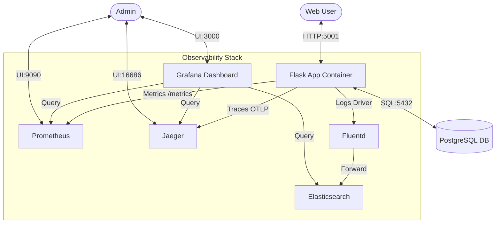

# Cybersecurity NGO Management: Architecture & Operations Guide

This document provides a detailed overview of the system architecture, setup instructions, operational commands, and observability configurations for the Cybersecurity NGO Management platform.

---

## 1. System Architecture

The platform is built as a containerized monolithic application with an integrated observability stack.

### High-Level Architecture Diagram



### Component Breakdown
1.  **Application (web)**: Python 3.11 / Flask 3.0. Handles business logic, session management, and server-side rendering (Jinja2).
2.  **Database (db)**: PostgreSQL 15. Stores persistent data for Users, Campaigns, and Donations.
3.  **Logging (fluentd & elasticsearch)**:
    *   **Fluentd**: Acts as the log collector using the Docker `fluentd` logging driver.
    *   **Elasticsearch**: Stores and indexes logs for fast searching and visualization.
4.  **Metrics (prometheus)**: Scrapes application metrics from the `/metrics` endpoint every 15 seconds.
5.  **Distributed Tracing (jaeger)**: Receives OpenTelemetry spans from the Flask app to visualize request lifecycles and DB latency.
6.  **Visualization (grafana)**: Unified dashboard for viewing metrics, traces, and logs.

---

## 2. Service & Port Reference

| Service | Hostname (Internal) | External Port | Internal Port | Description |
| :--- | :--- | :--- | :--- | :--- |
| **Web App** | `web` | `5001` | `5001` | Main Flask Application |
| **Postgres** | `db` | `5432` | `5432` | Relational Database |
| **Prometheus** | `prometheus` | `9090` | `9090` | Time-series Metrics Store |
| **Grafana** | `grafana` | `3000` | `3000` | Dashboard UI (Admin:admin) |
| **Jaeger UI** | `jaeger` | `16686` | `16686` | Distributed Tracing UI |
| **Elasticsearch** | `elasticsearch`| `9200` | `9200` | Log Storage & Search |
| **Fluentd** | `fluentd` | `24224` | `24224` | Log Collector/Forwarder |

---

## 3. Getting Started

### Prerequisites
- Docker & Docker Compose installed.
- (Optional) Python 3.11 for local development without Docker.

### Initial Setup & Run
1.  **Clone and Navigate**:
    ```bash
    cd Cybersecurity-NGO-Management
    ```
2.  **Start Services**:
    ```bash
    docker-compose up -d --build
    ```
3.  **Verify Services**:
    ```bash
    docker-compose ps
    ```
4.  **Initialize Data** (Optional):
    Visit `http://localhost:5001/admin/generate_dummy_data` to populate the database with test campaigns and donations.

---

## 4. Operational Commands

### Docker Management
| Task | Command |
| :--- | :--- |
| **Start everything** | `docker-compose up -d` |
| **Stop everything** | `docker-compose down` |
| **Restart one service**| `docker-compose restart web` |
| **View logs (App)** | `docker-compose logs -f web` |
| **View logs (All)** | `docker-compose logs -f` |

### Database Access
To jump into the PostgreSQL shell:
```bash
docker-compose exec db psql -U postgres -d ngo_db
```

### Dependency Management
If you add new libraries to `requirements.txt`:
```bash
docker-compose up -d --build web
```

---

## 5. Observability & Queries

### 📊 Prometheus (Metrics)
Access at: `http://localhost:9090`
- **Total Requests**: `flask_http_request_total`
- **Request Latency (95th percentile)**: 
  ```promql
  histogram_quantile(0.95, sum(rate(flask_http_request_duration_seconds_bucket[5m])) by (le))
  ```
- **App Uptime**: `time() - process_start_time_seconds{job="flask_app"}`

### 📈 Grafana (Visualization)
Access at: `http://localhost:3000` (Default: `admin` / `admin`)
- **Data Sources**: Pre-configured for Prometheus, Jaeger, and Elasticsearch.
- **Setup**: Create a new Dashboard and use the `Prometheus` datasource to plot `flask_http_request_total`.

### 🕵️ Jaeger (Tracing)
Access at: `http://localhost:16686`
- **Search**: Select Service `ngo-management-app`.
- **Insights**: Click on a trace to see the exact time spent in Flask routes vs. SQLAlchemy database queries.

### 📜 Fluentd & Elasticsearch (Logging)
Access ES API at: `http://localhost:9200`
- **Check Indices**: `GET /_cat/indices?v`
- **Search Logs**:
  ```bash
  curl -X GET "localhost:9200/fluentd-*/_search?pretty" -H 'Content-Type: application/json' -d'
  {
    "query": { "match_all": {} },
    "sort": [ { "@timestamp": "desc" } ]
  }'
  ```

---

## 6. Troubleshooting

### Common Issues

| Symptom | Cause | Solution |
| :--- | :--- | :--- |
| **Web app crashes on startup** | Postgres not ready. | The app waits for `db` but Postgres takes ~5s to boot. Simply run `docker-compose restart web` or wait for the auto-restart. |
| **No traces in Jaeger** | Gunicorn worker issue. | Ensure `OTLPSpanExporter` is initialized. If using multiple workers, check if the background processor is running. |
| **Fluentd connection error** | Docker network/Address. | Check `docker-compose.yml`. Use `fluentd-address: 127.0.0.1:24224`. Ensure the `fluentd` container is healthy. |
| **Elasticsearch fails to start** | Memory limits. | Elasticsearch requires at least 2GB RAM. If it crashes, check `docker stats` or ES logs for "Out of Memory". |

### How to debug a specific container
```bash
# Get shell access
docker-compose exec <service_name> sh

# Example for Fluentd config check
docker-compose exec fluentd fluentd --dry-run -c /fluentd/etc/fluent.conf
```
